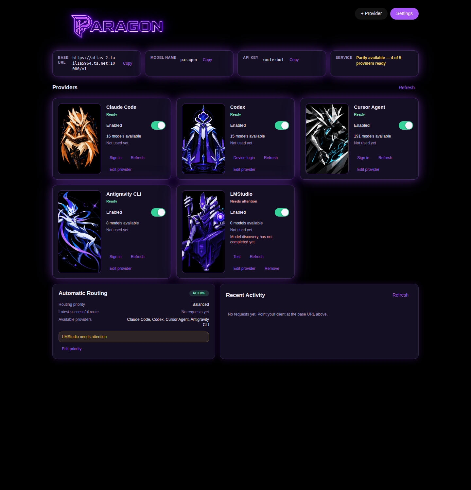

# PARAGON-D-004E — Production Router Activation and Everyday Product Simplification

**Status:** implemented, merged, **deployed and verified in production**.

**Implementation commit:** `291a1f6` on `main` (PR #19, squashed from
`paragon-d004e-production-activation`).
**Base commit:** `c911c58`.

---

## 1. What this changes

PARAGON was running two routing engines. The additive label scorer
(`src/routing/router.js`) decided every real route. The expected-utility engine
(`src/routing/shadowEngine.js`) ran alongside it on every request, produced a
complete ranking, and decided nothing. The dashboard exposed both, plus the
apparatus of the transition.

After this change there is one engine, it always executes, and the dashboard is
a product rather than a console.

---

## 2. Previous development-oriented interface inventory

Eleven `<section>` elements at `c911c58`, carrying seventeen headings:

| Section id | Heading | Disposition |
|---|---|---|
| `metrics` | (connection tiles) | **Kept**, reworked as Connection |
| `settings-panel` | Server | **Moved** into the one Settings surface |
| — | Providers | **Kept**, reworked |
| — | Routing | **Replaced** by the Automatic Routing card |
| — | Activity | **Replaced** by Recent Activity |
| `attempt-plans-panel` | Attempt plans | **Removed** → Diagnostics ▸ Routing |
| `legacy-preferences-panel` | Legacy live provider preferences | **Removed** (schema deleted) |
| `shadow-settings-panel` | Shadow routing settings — PARAGON-D-004D | **Removed** (subsystem deleted) |
| `deprecated-config-panel` | Deprecated compatibility fields | **Removed** (fields deleted) |
| `model-routing-panel` | Model Routing + sources & methodology | **Removed** → Diagnostics ▸ Models |
| `model-catalog-panel` | Model Catalog | **Removed** → Diagnostics ▸ Models |
| `routing-intelligence-panel` | Routing Intelligence (shadow) | **Removed** → Diagnostics ▸ Routing |
| `orchestration-panel` | Orchestration | **Removed** → Diagnostics ▸ System |
| `orch-settings-panel` | Live routing & enforcement settings — PARAGON-D-004C1 | **Removed** → Diagnostics ▸ System |

Three separate `Save` buttons existed (`#save`, `#save-shadow-settings`,
`#save-orch-settings`). The primary page carried two internal directive
identifiers in its own headings.

### Removed panels and controls

Every id above is asserted absent from the shipped assets, not merely collapsed
(`productDashboard.test.js` test 26), together with the accordion mechanism
itself (`panel-collapse-toggle`, `wireCollapsePanel`) so nothing can be
"present but hidden".

Also removed: the provider **model dropdown** (`data-key="model"`), the
default-provider selector, the fallback-chain editor, the task-preference
editor, and the shadow settings API.

---

## 3. Sole-router activation proof

`selectAutomaticRoute()` in `src/routing/automaticRouting.js` is the only
routing computation on the request path.

- `src/routing/router.js` — **deleted**. No source file imports it, and no
  source references `scoringMethodology` or `rankRegistryByTask`
  (`productionActivation.test.js` test 1/2).
- `src/routing/shadowEngine.js`, `src/routing/shadowStore.js`,
  `src/deprecatedConfig.js` — **deleted** (test 3/5).
- Exactly one `selectAutomaticRoute(` call site exists in `src/openaiApi.js`,
  and no `computeShadowRoute` or second scorer (test 6).
- No response header matches `/shadow/i` (test 4), verified again against a
  live server's real response headers (`productionActivation.api.test.js`
  test 4).
- Live header on a real request: `X-Paragon-Route-Reason: automatic.expectedUtility`.

Execution order is fixed: request profile → eligible candidates → hard gates
(capability, context, health, circuit, cost ceiling, quota, catalog) → expected
utility → explicit tie-breaks → bounded attempt plan → registry verification →
execute → record outcomes.

### Integrity gates preserved

`routingIntegrity.test.js` was ported to the new engine and passes 28/28,
including: no static fallback, forced routes only ever *narrow*, forced routes
still obey cost ceiling / context / health / quota, unassessed providers
contribute nothing, provider-default requires a validated entry, non-chat
models cannot enter chat routing, and every attempt maps to an eligible
candidate.

---

## 4. Usage-evidence handling

Captured in `src/routing/usageEvidence.js`, in the directive's evidence order.

| Source | Implemented | Evidence |
|---|---|---|
| OpenAI-compatible HTTP response usage | ✅ | `extractOpenAiUsage`, incl. `stream_options.include_usage` for streamed requests |
| Provider CLI structured output | ✅ | `claude --output-format json`; generic JSON/JSONL reader |
| Provider CLI diagnostic output | ➖ | falls through to `unknown` |
| Provider account/usage endpoint | ➖ | none of the supported providers expose one |
| Measured bounded estimate | ✅ | telemetry EWMA over real observations |
| Unknown | ✅ | explicit, and penalized |

The claude contract was **verified against the installed CLI**, not assumed:

```json
{"type":"result","total_cost_usd":0.020251,"result":"OK",
 "usage":{"input_tokens":9,"cache_creation_input_tokens":9421,
          "cache_read_input_tokens":0,"output_tokens":280}}
```

Live proof through the real gateway (forced to claude):

```
usage: { "prompt_tokens": 7670, "completion_tokens": 4, "total_tokens": 7674,
         "paragon_usage_source": "provider_cli_structured",
         "paragon_usage_confidence": "high" }
content: "OK"
```

The JSON envelope is unwrapped, so callers still receive prose — verified on the
streaming path too, which emitted plain `OK` and no envelope.

**Codex was deliberately left on text output.** Its `--json` mode emits a JSONL
event stream, but this account cannot run any codex model
(`The 'gpt-5.3-codex' model is not supported when using Codex with a ChatGPT
account`), so its usage-event shape could not be verified. Guessing at it would
be the same class of error this directive exists to remove. It reports
`unknown` and is costed conservatively. Listed under remaining work.

### Unknown-usage behavior

Unknown is never zero, at four separate layers:

1. **Normalization** — `positiveNumber()` guards `value == null` explicitly.
   `Number(null)` is `0` and finite, so without that guard an absent field
   became a *zero measurement*. **Found by a live end-to-end request**, which
   returned `"reasoning_tokens": 0` for a provider that reported nothing.
2. **Telemetry** — `ewma()` refuses `null`, and `numberOrNull()` feeds it.
   Verified against a clean store: a provider reporting nothing records
   `observedInputTokens: null`, not `0`.
3. **Cost** — an unknown reasoning profile is charged a conservative floor (the
   `high`-effort prior midpoint) instead of `?? 0`, and an unpriced metered
   provider is charged a token-proportional relative cost, so absence of
   pricing cannot become a perfect cost score.
4. **Scoring** — both paths add an uncertainty penalty that reaches the utility
   total (`uncertaintyTerm > 0`).

The client-facing `usage` block still reports integers for OpenAI compatibility,
but labels them: `paragon_usage_source: "unknown"`, `paragon_usage_confidence:
"none"`, and omits `completion_tokens_details` entirely rather than claiming
zero reasoning.

### Subscription and quota handling

Built against a **real** provider error rather than an imagined one. cursor was
genuinely at its limit during implementation:

```
ActionRequiredError: You've hit your usage limit … Your usage limits will reset
when your monthly cycle ends on 8/12/2026.
```

That message classified as `TRANSIENT_FAILURE` and was **retried against an
allowance that was definitively spent**. Now:

- `classifyModelFailure` recognises `usage limit` / `spend limit` / `usage cap` /
  `monthly cycle ends` → `QUOTA_EXHAUSTED`.
- `parseQuotaReset` extracts the instant (ISO, US calendar date, or relative
  window), clamped to 40 days so a misparse cannot exile a provider.
- The provider becomes **hard-ineligible** until that reset — a gate, not a
  penalty — and a successful execution is authoritative recovery evidence.
- Scarcity is derived from *observed* exhaustion across enabled providers, never
  an invented monetary figure.

Live proof from the running system:

```json
"cursor": { "exhaustedAt": "2026-07-30T13:48:12.150Z",
            "resetAt": "2026-08-12T00:00:00.000Z",
            "resetSource": "provider_calendar_date",
            "classification": "QUOTA_EXHAUSTED", "observedFailures": 1 }
```

---

## 5. Request and fallback examples

Real request through the rebuilt engine, with cursor exhausted:

```
planned:  cursor / cursor-grok-4.5-medium-fast
executed: antigravity / gemini-3.5-flash-medium   (fallback: true)
```

The product Activity entry reads:

> **antigravity / gemini-3.5-flash-medium** — Succeeded in 7.4s
> Recovered after *cursor reached its usage limit*

Attribution is to the provider-model that **actually returned the response**,
not the plan head. Planned, attempted, executed and failed are kept distinct in
`routeActivity`: a failed provider reports `lastUsed: null` and a separate
`lastFailure`.

Fallback is classified:
- model-specific (`MODEL_NOT_FOUND`/`REJECTED`/`UNAVAILABLE`) → advance to
  another model **from the same provider**;
- provider-wide (auth, quota, entitlement, offline, misconfigured) → abandon
  that provider's remaining attempts entirely.

Both are covered end-to-end (`productionActivation.api.test.js` tests 35, 36,
36b), and no provider-model is dispatched twice in one request (test 34/6/37,
asserted by counting real fixture invocations).

---

## 6. Config migration and backup proof

Schema **v2 → v3**. Removed: `providers.*.model`, `routing.defaultProvider`,
`routing.fallbackChain`, `routing.taskRoutes`, `routingIntelligence.mode`,
`routingIntelligence.shadowRecordLimit`, `routingIntelligence.quotaScarcity`.
`routingIntelligence` → `automaticRouting`.

The seven task-provider mappings are **removed, not translated**. Converting
them into utility weights would reintroduce the provider preference this
release exists to delete, while claiming the operator asked for it. The old
values are written to the migration log and preserved in the backup.

Verified against a **disposable copy of the real production config**:

```
backed up previous config to data/config.backup.2026-07-30T13-32-09-716Z.json
removed providers.claude.model (was "claude-opus-5")
removed providers.cursor.model (was "composer-2.5")
removed providers.antigravity.model (was "gemini-3.6-flash-high")
removed providers.lmstudio.model (was "google/gemma-4-26b-a4b-qat")
removed routing.defaultProvider (was "codex")
removed routing.fallbackChain (was ["codex","claude","cursor","lmstudio"])
removed routing.taskRoutes (was {"code":"codex",…7 entries})
removed routingIntelligence.mode (was "shadow")
schema now at version 3
```

| Check | Result |
|---|---|
| Backup byte-identical to the live production config | ✅ |
| API key preserved | ✅ |
| Tailscale host + serve/funnel ports preserved | ✅ `atlas-2…:9420/:10000` |
| Cursor base URL preserved | ✅ |
| All 5 providers present, enablement preserved | ✅ |
| Provider avatars preserved | ✅ |
| lmstudio baseUrl/apiKey preserved | ✅ |
| Discovered model lists preserved | ✅ 34/13/193/11/6 |
| Orchestration settings preserved | ✅ `live`, enabled |
| Survives restart without re-migrating | ✅ one backup, still v3 |

The backup is written **before** anything is removed, and the write path also
strips a removed field a client posts back.

---

## 7. Everyday dashboard

Primary page: **Connection, Providers, Automatic Routing, Recent Activity** —
exactly four labelled regions, asserted exhaustively.



*(Captured from a real headless browser against a live server carrying the
production config. A pixel "before" capture was not possible — the old
dashboard holds an SSE log stream open, so headless capture never completes;
the before-state is documented as the structural inventory in §2, taken from
the markup at `c911c58`.)*

Provider cards show identity and avatar, enabled state, Ready / Needs attention
/ Usage limit reached, eligible model count, and the model that actually ran
last. There is **no model selector**. Internal catalog counts appear only when
a provider has a problem.

### One save action

Exactly one `Save Changes` button exists in the shipped markup, in Settings.
No other button's label begins with "Save" (asserted by extracting every button
label from `index.html`). The three retired per-panel save handlers are gone.

Immediate actions — connect, sign in, test, refresh, validate, avatar, clear
history, enable/disable, edit provider — persist at once and report their own
success or failure. Saving one settings category preserves every unrelated
value, verified at the HTTP level against credentials, provider enablement,
avatars, commands and Tailscale settings.

### Diagnostics inventory

One surface, reached from Settings, organised as four tabs:

| Tab | Contents |
|---|---|
| **Models** | Eligible registry, catalog state, benchmark attribution, context/capability evidence, refresh all, validate all, inspect a model |
| **Routing** | Selection method, computations-per-request, routing priority + **resolved weights (read-only)**, bounds, usage-limited providers, latest attempt plan, ranked candidates with utility decomposition and exclusion reasons |
| **Requests** | Request outcomes, fallback history, durations, per-model usage evidence (incl. "not reported" rather than 0), raw log |
| **System** | Circuit states, quota state, catalog scheduler, config version, orchestration, storage, export bundle |

Diagnostics is read-only apart from explicit maintenance actions, and carries no
save button.

### First-run experience

Shown when no provider yet contributes an eligible model: connect a provider →
Base URL / model name / API key with copy buttons and a copy-ready client
configuration → an optional **real** test request through PARAGON's own `/v1`
surface. It exposes no catalog, weights, orchestration or transition-era
terminology.

### Product language

No normal UI surface contains `shadow`, a `PARAGON-D-…` identifier, "expected
utility", "advisory", "deprecated", "orchestration" or "enforcement policy" —
asserted separately for the primary page and each user-facing dialog, since
technical vocabulary is permitted inside Diagnostics and nowhere else.

---

## 8. Routing priority behavior

`routing.priority` ∈ {`balanced`, `quality`, `cost`, `speed`}, default
**`balanced`**. Resolves transparently to expected-utility weights.

| Preset | Documented effect |
|---|---|
| Balanced | Baseline; identical to the exported weights |
| Best quality | ×1.5 quality, ×0.5 cost, ×0.6 latency, ×0.6 reasoning-fit (may select higher reasoning when justified) |
| Lower cost | ×2.2 cost, ×2.5 quota scarcity, ×0.9 quality (never zero — capability minimums remain gates) |
| Faster | ×3 latency, ×0.95 quality (cannot select an incapable model for being quick) |

A preset alters **only** documented weights, can never reintroduce a provider
preference (`taskRoutePreferenceBonus` pinned to `0` in every preset), and can
never rescue an inadmissible candidate — asserted for all four presets against a
catalog-rejected model.

---

## 9. Defects found and fixed while activating the gates

The expected-utility engine had never been load-bearing. Making it live exposed
four real defects, all fixed here:

1. **Structured output was an unsatisfiable hard gate.** No text-completion
   provider can *prove* `structuredOutput`, and `unknown` never satisfies a
   requirement — so **every** `response_format` request excluded every candidate
   and returned `503 no_eligible_model`. PARAGON already verifies JSON after the
   fact and escalates, so it is now a bounded scoring preference, not a gate.
2. **Operator-added CLI providers were excluded from every streaming request.**
   `generic-cli` had no structural capability entry, leaving `streaming:
   "unknown"`, though streaming is implemented by the gateway for every
   provider.
3. **The enforcement context ceiling was unreachable.** Evaluated after routing,
   an oversized request was reported as `no_eligible_model` instead of the
   configured ceiling. Policy gates (session, context, concurrency) now run
   before routing, since they are decisions about the request, not candidates.
4. **`structuredOutputValid` was hardcoded `true` on success**, which would have
   recorded a provider returning prose to a JSON request as fully compliant —
   inverting the one quality signal PARAGON can actually measure. It now
   reflects the real validation result.

Plus one product defect found by screenshotting the rebuilt UI in a real
browser: `[hidden]` is a user-agent rule at specificity (0,1,0), so
`.onboarding { display: flex }` and `.field { display: grid }` silently defeated
it — the first-run overlay rendered on top of a configured dashboard, and
HTTP-only fields appeared when editing a CLI provider.

---

## 10. Tests

**356 passing, 0 failing**, stable across three consecutive full runs.
`npm run check` green (suite + release checks). `git diff --check` clean.

| Suite | Purpose |
|---|---|
| `productionActivation.test.js` (29) | Sole engine, usage evidence, unknown-usage honesty, quota gate, priority presets, migration |
| `productionActivation.api.test.js` (14) | The same contract end-to-end over HTTP with real fixture providers |
| `productDashboard.test.js` (26) | Four product areas, one save, product language, no model dropdown, Diagnostics completeness, first-run flow, avatars |
| `routingIntegrity.test.js` (28) | Every routing-integrity invariant, ported to the production engine |
| `automaticRouting.test.js` (41) | Engine internals: profiles, cost, capability, context, plans, telemetry, tie-breaks |

Retired: `router.test.js`, `dashboardRoutingTruth*.test.js`,
`routingIntelligence.api.test.js` — they existed only to test the removed
scorer and the dual-engine dashboard. Every invariant worth keeping was ported.

One pre-existing flaky test was made hermetic: a forced-route assertion depended
on the *real* codex CLI's health, which can legitimately report unhealthy under
parallel load.

---

## 11. Deployment

Deployed as one atomic operator action on 2026-07-30. The restart required an
interactive sudo password, so the agent stopped after preparing the backup and
the operator performed the fast-forward and restart together — production was
never left with a new front end against the old backend.

### Restart proof

| Fact | Before | After |
|---|---|---|
| Commit | `c911c58` | **`ee7379c`** |
| MainPID | `122137` | **`324456`** |
| Start | 2026-07-30 08:16:01 EDT | **2026-07-30 13:34:48 EDT** |
| NRestarts | 0 | **0** |
| Checkout | clean | **clean** |

Running binary confirmed as `/home/sketch/Projects/paragon-production/src/server.js`
under the new PID.

### Behavioral proof

The new API surface answers and the retired one is gone:

```
/api/overview 200   /api/settings 200   /api/activity 200
/api/diagnostics/{models,routing,system} 200
/api/routing/status, /api/routing-intelligence, …/shadow-records
    -> dashboard HTML, no shadow payload
```

**Migration ran against the real config**: `configVersion: 3`, with its own
pre-change backup at `data/config.backup.2026-07-30T17-34-49-241Z.json`.
`routing` is now `{"priority": "balanced"}`, no provider carries `.model`,
`routingIntelligence` is gone and `automaticRouting` is present.

A full diff of the live config against the pre-deploy backup, excluding the
intentionally removed fields, shows **no unintended changes**. API key,
Tailscale host and both ports, cursor base URL, all five providers and their
enablement, avatars and discovered model lists (34/13/193/11/6) are identical.

**A real request through production**, with cursor genuinely at its monthly
limit:

```
X-Paragon-Route-Reason:      automatic.expectedUtility
X-Paragon-Routing-Priority:  balanced
(no shadow header present)

planned:  cursor / cursor-grok-4.5-medium-fast
executed: antigravity / gemini-3.6-flash-medium   fallback: true   7.6s
content:  "OK"
usage:    paragon_usage_source "unknown", confidence "none"
```

The product Activity list rendered it as:

> 17:36 · **antigravity / gemini-3.6-flash-medium** — succeeded in 7.6s
> — recovered after *cursor reached its usage limit*

and the exhaustion was recorded from cursor's own message:

```json
"cursor": { "resetAt": "2026-08-12T00:00:00.000Z",
            "resetSource": "provider_calendar_date",
            "classification": "QUOTA_EXHAUSTED", "observedFailures": 1 }
```

**Real usage capture in production** (forced to claude):

```json
{ "prompt_tokens": 50778, "completion_tokens": 6, "total_tokens": 50784,
  "paragon_usage_source": "provider_cli_structured",
  "paragon_usage_confidence": "high" }
```

**Public API unchanged**: `/v1/models` returns `paragon` and the
`routerbot-local` compatibility alias. Ports 4117 / 9420 / 10000 unchanged.

**Dashboard in production** (headless render of the live service): four product
areas, 5 provider cards, onboarding correctly hidden, exactly one `Save Changes`
button, and no occurrence of "shadow" in any rendered text.

No shadow state is persisted — `data/` holds only `config.json`, the migration
backup, `model-catalog.json`, `routing-telemetry.json`, `orchestration/` and
`backups/`.

### Rollback

Pre-deploy backup: `/home/sketch/Projects/backups/paragon-d004e-20260730T132049/`
(full `data/` copy, `production-commit.txt`, `service-before.txt`).

```bash
sudo systemctl stop paragon.service
cd /home/sketch/Projects/paragon-production && git reset --hard c911c58
cp -a /home/sketch/Projects/backups/paragon-d004e-20260730T132049/data/. data/
sudo systemctl start paragon.service
```

The migration's own `data/config.backup.2026-07-30T17-34-49-241Z.json` is a
second, independent rollback point for configuration alone.

---

## 12. Remaining non-blocking product work

1. **Codex usage capture.** Left on text output because this account cannot run
   any codex model, so its `--json` usage-event shape could not be verified
   against reality. It reports `unknown` and is costed conservatively. Worth
   enabling once a working codex model is available.
2. **cursor / antigravity structured output.** Both CLIs advertise
   `--output-format json`; neither shape was verifiable during implementation
   (cursor was at its usage limit). The generic reader will pick them up once
   enabled and verified.
3. **`orchestration/shadowGovernor.js` retains the name.** It is the governor
   that *proposes without enforcing* — a different concept from the retired
   dual-engine routing, and not user-visible. Renaming is cosmetic churn across
   a large suite; noted rather than done.
4. **Monetary cost is not yet surfaced in the product UI.** It is captured
   (claude reports real `total_cost_usd`) and visible in Diagnostics, but there
   is no spend display or budget control on the primary page. The directive's
   "maximum spending controls" setting is only meaningful once a metered
   provider is configured.
5. **No pixel "before" screenshot**, for the SSE reason given in §7.
6. **`lmstudio` needs attention in production** — model discovery has not
   completed for it, so it contributes nothing routable. Pre-existing, and
   correctly surfaced by the new provider card rather than hidden.
